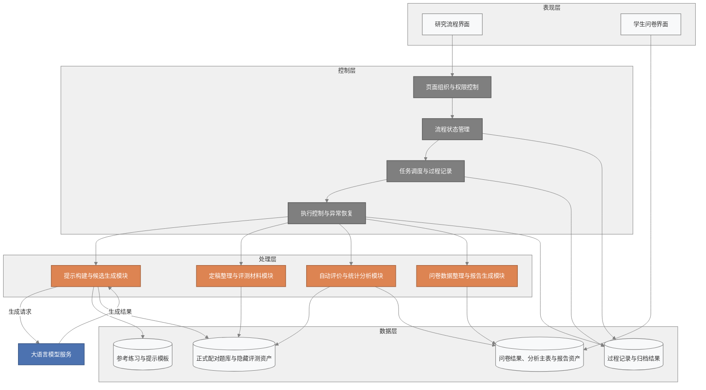
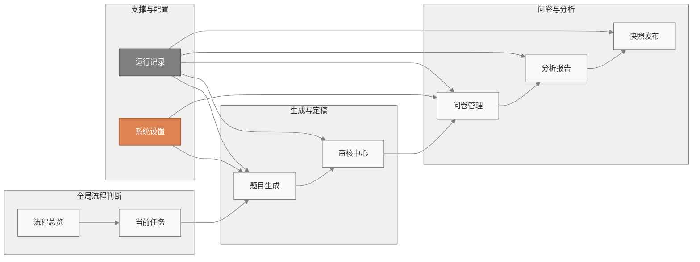
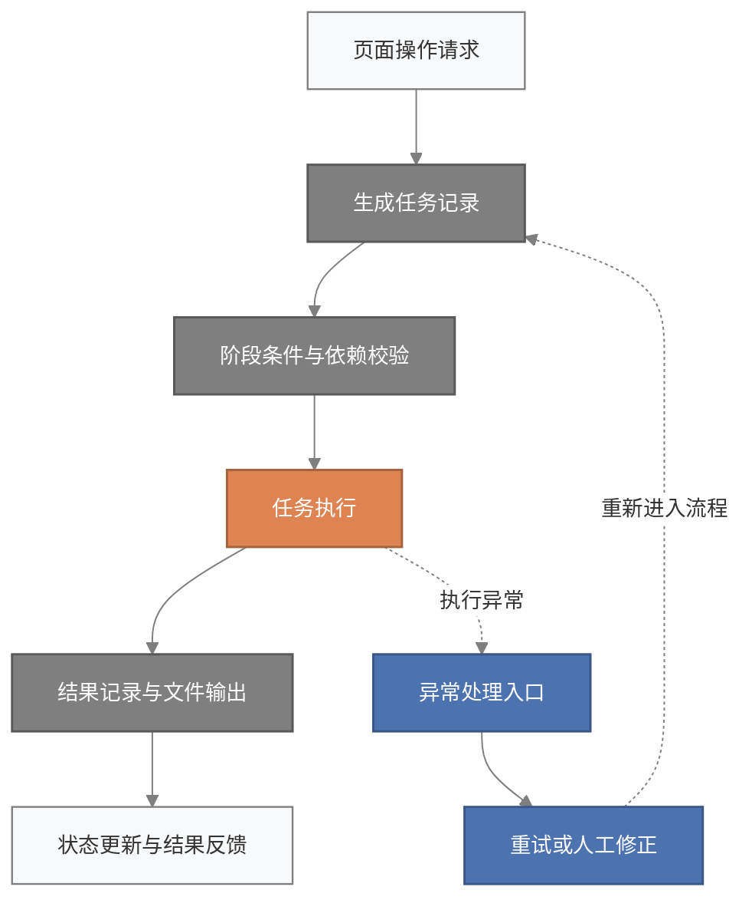
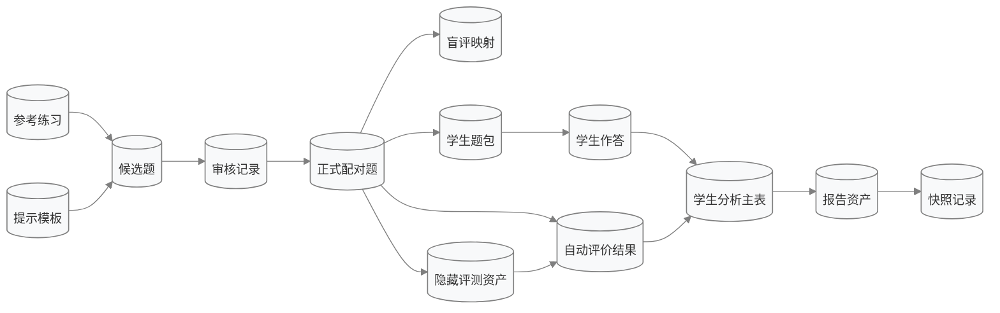

# 第 4 章图题、图注、表题与表注（终稿）

以下内容面向当前《基于大语言模型的深度学习编程题自动生成》研究原型，已与 [chapter4_system_design_rewrite.md](D:/Downloads/PythonProjectQA/docs/chapter4_system_design_rewrite.md) 的正式版目录与正文保持一致。图表按第四章的论述顺序重新编排，用于支撑系统定位、总体架构、核心流程、数据组织与运行保障等内容。

说明：下列 Mermaid 图均沿用原稿配色，不改变原有学术蓝 `#4C72B0`、橙 `#DD8452`、灰 `#7F7F7F` 的视觉体系。

## 图 4-1 研究流程与系统闭环图

```mermaid
---
config:
  theme: base
  themeVariables:
    fontFamily: '"Times New Roman", SimSun, STSong, serif'
    fontSize: 14px
    lineColor: '#7F7F7F'
    textColor: '#333333'
    primaryColor: '#F8F9FA'
    primaryTextColor: '#333333'
    primaryBorderColor: '#7F7F7F'
    secondaryColor: '#E9EEF5'
    secondaryTextColor: '#333333'
    secondaryBorderColor: '#7F7F7F'
    tertiaryColor: '#F0F0F0'
    tertiaryTextColor: '#333333'
    tertiaryBorderColor: '#7F7F7F'
    mainBkg: '#F8F9FA'
    nodeBorder: '#7F7F7F'
    clusterBkg: '#F0F0F0'
    clusterBorder: '#7F7F7F'
    defaultLinkColor: '#7F7F7F'
    edgeLabelBackground: '#FFFFFF'
    titleColor: '#333333'
---
flowchart LR
    classDef ai fill:#4C72B0,stroke:#3A5785,stroke-width:1.5px,color:#FFFFFF;
    classDef expert fill:#DD8452,stroke:#A6633D,stroke-width:1.5px,color:#FFFFFF;
    classDef aux fill:#7F7F7F,stroke:#595959,stroke-width:1.5px,color:#FFFFFF;
    classDef neutral fill:#F8F9FA,stroke:#7F7F7F,stroke-width:1.2px,color:#333333;
    classDef lane fill:#F0F0F0,stroke:#7F7F7F,stroke-width:1px,color:#333333;

    subgraph LaneA[受控生成与样本准备]
        A[参考练习整理与元数据抽取]
        B[提示模板与控制变量]
        C[候选题生成]
        D[自动过滤与候选池整理]
    end

    subgraph LaneB[人工筛选与学生评价]
        E[研究员审核]
        F[定稿入库与盲映射整理]
        G[评测材料补充]
        H[题包准备与问卷发放]
        I[问卷回收与样本确认]
    end

    subgraph LaneC[自动分析与结果归档]
        J[自动评价与功能正确性验证]
        K[学生分析主表构建]
        L[显著性分析、相关分析与报告生成]
        M[结果快照与正式资产归档]
        N[反馈修订]
    end

    A --> B
    B --> C
    C --> D
    D --> E
    E --> F
    F --> G
    F --> H
    G --> J
    H --> I
    I --> K
    J --> L
    K --> L
    L --> M

    E -.->|驳回或重生成| N
    J -.->|评测发现问题| N
    N -.->|调整模板与生成条件| B

    class A,B,D,F,I,K,M neutral
    class C ai
    class E,H,N expert
    class G,J,L aux
    class LaneA,LaneB,LaneC lane
```

图注：
当前研究原型围绕“受控生成、人工审核、学生评价、自动分析、结果归档”形成完整闭环。系统首先根据参考练习与提示模板生成候选题，并通过自动过滤和研究员审核确定正式样本；之后，正式样本一方面进入评测材料补充与自动评价环节，另一方面进入题包准备、问卷发放、问卷回收与样本确认环节；自动评价结果与学生评价结果最终汇入统计分析与报告生成环节，并形成可归档的正式研究资产。对于审核未通过或评测发现问题的样本，系统支持反馈修订并回流至生成前端，从而体现研究流程中的可追踪迭代机制。

## 图 4-2 当前系统实现架构图

图注：
当前系统采用“表现层 + 控制层 + 处理层 + 数据层”的实现结构。表现层由研究流程界面和学生问卷界面构成；控制层负责页面组织、权限控制、流程状态管理、任务调度与异常恢复；处理层负责提示构建、候选生成、定稿整理、评测材料补充、自动评价、问卷数据整理以及报告生成；数据层负责存储提示模板、正式配对题库、隐藏评测资产、问卷结果、分析主表、报告资产和归档结果。大语言模型服务通过候选生成模块与系统交互，承担候选练习内容生成任务。

## 图 4-3 当前原型页面与研究环节对应图

图注：
当前原型界面按照研究流程进行组织，而不是按照结果展示进行组织。其中，“流程总览”和“当前任务”负责识别当前批次所处阶段；“题目生成”和“审核中心”负责候选生成、审核定稿与评测材料补充；“问卷管理”和“分析报告”分别承接学生评价组织与统计报告生成；“快照发布”用于归档正式结果；“运行记录”和“系统设置”则分别承担过程追踪与全局配置支持功能。该页面结构与研究步骤一一对应，便于在论文中说明系统如何支撑实际研究流程。

## 图 4-4 任务编排与异常恢复机制图

图注：
为保证研究流程可追踪、可回放、可恢复，当前系统在页面动作与底层处理流程之间引入了显式的任务编排机制。每次关键处理都会先生成任务记录，再检查阶段依赖与执行条件，然后进入任务执行、结果记录和状态反馈环节；若执行过程中出现异常，则通过统一的异常处理入口支持重试或人工修正，并重新进入主流程。该机制使研究流程中的关键步骤具有更强的可追踪性和可维护性。

## 图 4-5 自动评价、学生问卷与报告生成数据流图

```mermaid
---
config:
  theme: base
  themeVariables:
    fontFamily: '"Times New Roman", SimSun, STSong, serif'
    fontSize: 14px
    lineColor: '#7F7F7F'
    textColor: '#333333'
    primaryColor: '#F8F9FA'
    primaryTextColor: '#333333'
    primaryBorderColor: '#7F7F7F'
    secondaryColor: '#E9EEF5'
    secondaryTextColor: '#333333'
    secondaryBorderColor: '#7F7F7F'
    tertiaryColor: '#F0F0F0'
    tertiaryTextColor: '#333333'
    tertiaryBorderColor: '#7F7F7F'
    mainBkg: '#F8F9FA'
    nodeBorder: '#7F7F7F'
    clusterBkg: '#F0F0F0'
    clusterBorder: '#7F7F7F'
    defaultLinkColor: '#7F7F7F'
    edgeLabelBackground: '#FFFFFF'
    titleColor: '#333333'
---
flowchart LR
    classDef ai fill:#4C72B0,stroke:#3A5785,stroke-width:1.5px,color:#FFFFFF;
    classDef expert fill:#DD8452,stroke:#A6633D,stroke-width:1.5px,color:#FFFFFF;
    classDef aux fill:#7F7F7F,stroke:#595959,stroke-width:1.5px,color:#FFFFFF;
    classDef neutral fill:#F8F9FA,stroke:#7F7F7F,stroke-width:1.2px,color:#333333;

    A[(正式配对题库)]
    B[(隐藏评测资产)]
    C[自动评价处理]
    D[(自动指标与功能正确性检验结果)]
    E[问卷材料准备]
    F[(学生题包与盲评材料)]
    G[学生问卷作答]
    H[(问卷回收结果)]
    I[样本确认与主表构建]
    J[(学生分析主表)]
    K[统计分析与报告生成]
    L[(第 5 章输出与报告摘要)]

    A --> C
    B --> C
    C --> D
    A --> E
    E --> F
    F --> G
    G --> H
    H --> I
    D --> I
    I --> J
    J --> K
    D --> K
    K --> L

    class A,B,D,F,H,J,L neutral
    class C,I,K aux
    class E,G expert
```

图注：
正式配对题库和隐藏评测资产共同驱动自动评价处理，形成自动指标与功能正确性检验结果；与此同时，正式配对题库还驱动问卷材料准备流程，用于组织学生评价。问卷回收结果与自动评价结果在样本确认与主表构建阶段汇合，形成统一的学生分析主表，随后进入统计分析、报告生成与第 5 章结果输出环节。该数据流图清楚展示了自动评价与学生评价如何在当前系统中汇聚为统一的分析基础。

## 图 4-6 系统功能分解图

```mermaid
---
config:
  theme: base
  themeVariables:
    fontFamily: '"Times New Roman", SimSun, STSong, serif'
    fontSize: 14px
    lineColor: '#7F7F7F'
    textColor: '#333333'
    primaryColor: '#F8F9FA'
    primaryTextColor: '#333333'
    primaryBorderColor: '#7F7F7F'
    secondaryColor: '#E9EEF5'
    secondaryTextColor: '#333333'
    secondaryBorderColor: '#7F7F7F'
    tertiaryColor: '#F0F0F0'
    tertiaryTextColor: '#333333'
    tertiaryBorderColor: '#7F7F7F'
    mainBkg: '#F8F9FA'
    nodeBorder: '#7F7F7F'
    clusterBkg: '#F0F0F0'
    clusterBorder: '#7F7F7F'
    defaultLinkColor: '#7F7F7F'
    edgeLabelBackground: '#FFFFFF'
    titleColor: '#333333'
---
flowchart TB
    classDef ai fill:#4C72B0,stroke:#3A5785,stroke-width:1.5px,color:#FFFFFF;
    classDef expert fill:#DD8452,stroke:#A6633D,stroke-width:1.5px,color:#FFFFFF;
    classDef aux fill:#7F7F7F,stroke:#595959,stroke-width:1.5px,color:#FFFFFF;
    classDef neutral fill:#F8F9FA,stroke:#7F7F7F,stroke-width:1.2px,color:#333333;
    classDef lane fill:#F0F0F0,stroke:#7F7F7F,stroke-width:1px,color:#333333;

    SYS[研究流程原型系统]

    subgraph M1[受控生成模块]
        A1[提示模板管理]
        A2[控制变量配置]
        A3[候选题生成]
        A4[自动过滤]
    end

    subgraph M2[审核与正式入库模块]
        B1[候选题审核]
        B2[评测材料补充]
        B3[正式入库]
        B4[盲映射整理]
    end

    subgraph M3[问卷组织模块]
        C1[题包准备]
        C2[发放材料生成]
        C3[回收查看]
        C4[样本确认]
    end

    subgraph M4[自动评价与分析模块]
        D1[功能正确性验证]
        D2[自动指标计算]
        D3[主表构建]
        D4[报告生成]
    end

    subgraph M5[运行保障模块]
        E1[流程状态管理]
        E2[任务记录]
        E3[异常恢复]
        E4[快照归档]
    end

    SYS --> M1
    SYS --> M2
    SYS --> M3
    SYS --> M4
    SYS --> M5

    A4 --> B1
    B3 --> C1
    B2 --> D1
    C4 --> D3
    D4 --> E4
    E1 --> A3
    E2 --> B3
    E3 --> D1

    class SYS ai
    class A1,A2,A4,B4,C3,C4,D3,E1 neutral
    class A3,B1,B2,B3,C1,C2,D4 expert
    class D1,D2,E2,E3,E4 aux
    class M1,M2,M3,M4,M5 lane
```

图注：
从功能组成角度看，当前研究原型可划分为受控生成、审核与正式入库、问卷组织、自动评价与分析、运行保障五个核心模块。受控生成模块负责提示模板管理、控制变量配置、候选题生成和自动过滤；审核与正式入库模块负责候选题审核、评测材料补充、正式入库和盲映射整理；问卷组织模块负责题包准备、发放材料生成、回收查看与样本确认；自动评价与分析模块负责功能正确性验证、自动指标计算、主表构建和报告生成；运行保障模块负责流程状态管理、任务记录、异常恢复和快照归档。该图有助于说明系统内部功能分工及其衔接关系。

## 图 4-7 核心数据关系图

图注：
系统中的核心数据对象可概括为参考练习、提示模板、候选题、审核记录、正式配对题、盲评映射、隐藏评测资产、学生题包、学生作答、自动评价结果、学生分析主表、报告资产和快照记录等。参考练习与提示模板共同支撑候选题生成；候选题经审核记录后转化为正式配对题；正式配对题进一步关联盲评映射和隐藏评测资产，以分别支撑学生问卷阶段的来源隐藏和自动评价阶段的功能正确性验证；学生作答结果与自动评价结果在主表构建阶段汇合，形成统一的学生分析主表，并最终关联报告资产与快照记录。该图有助于从逻辑关系层面说明系统数据对象之间的依赖与衔接。

## 补充截图建议（可选）

如需在第 4 章增加界面截图，可优先考虑以下四张：
- 流程总览页面
- 题目生成页面
- 审核中心页面
- 问卷管理或分析报告页面

用途说明：
用于支撑 4.8“关键页面与交互支持”，作为辅助性界面说明材料，而不替代系统结构、流程或数据设计图。

## 表 4-1 系统角色与主要职责对应表

| 角色 | 主要职责 | 典型操作 | 对应章节 |
|---|---|---|---|
| 研究员 | 承担研究流程中的主要操作任务 | 配置生成条件、审核候选题、补充评测材料、确认样本、生成报告 | 4.2 |
| 管理员 | 负责全局配置、状态维护与结果归档 | 管理批次、控制页面可见范围、发布快照 | 4.2 |
| 学生 | 作为评价参与者提交问卷反馈 | 阅读题目、评分、提交整包反馈 | 4.2 |
| 大语言模型服务 | 作为外部生成服务参与候选题形成 | 接收生成请求、返回候选练习内容 | 4.3 |

表注：该表用于概括系统中的主要参与角色及其职责分工，说明研究员、管理员、学生和外部大语言模型服务在当前原型中的功能定位与交互边界。

## 表 4-2 核心功能模块与输入输出表

| 模块 | 主要输入 | 核心处理 | 主要输出 |
|---|---|---|---|
| 受控生成模块 | 参考练习元数据、提示模板、控制变量 | 提示构建、候选生成、自动过滤 | 候选题池、生成记录 |
| 审核与正式入库模块 | 候选题、过滤结果、评测材料状态 | 人工审核、驳回或重生成、正式入库 | 正式配对题库、盲评映射、人工智能生成练习样本库 |
| 问卷组织模块 | 正式题库、盲评映射、回收结果 | 题包准备、发放材料生成、样本确认 | 学生题包、回收结果、分析输入说明 |
| 自动评价与报告生成模块 | 正式题库、隐藏评测资产、问卷结果 | 功能正确性验证、自动指标计算、主表构建、统计分析、报告生成 | 自动评价结果、学生分析主表、报告结果 |
| 运行保障模块 | 阶段状态、页面动作、处理规则 | 状态维护、任务记录、异常恢复、快照归档 | 处理记录、操作记录、快照结果 |

表注：该表从输入、处理与输出三个方面归纳系统核心功能模块，用于说明各模块在研究流程中的具体分工及其相互衔接关系。

## 表 4-3 关键数据资产与研究用途对应表

| 数据资产 | 代表文件 | 研究用途 |
|---|---|---|
| 提示模板 | prompts/v1/master/MP-v1.md 及四类子模板 | 约束生成条件，保证与参考题的可比性 |
| 候选题与过滤结果 | outputs/raw_generations 与 outputs/filtered | 保存生成候选题并支持自动过滤与审核准备 |
| 正式配对题库 | results/curated/final_pairs.curated.v1.jsonl | 作为自动评价、问卷组织和后续分析的核心样本 |
| 盲评映射 | results/curated/blind_mapping.curated.v1.csv | 支持问卷阶段的来源隐藏与统一展示 |
| 隐藏评测资产 | reference_solutions.curated.v1.jsonl / executable_tests.curated.v1.jsonl | 支持功能正确性验证和自动评测 |
| 自动评价结果 | exercise_metrics.curated.v1.csv / exercise_correctness_metrics.curated.v1.csv | 量化比较人工智能生成练习与专家练习 |
| 学生问卷材料 | student_package_manifest.curated.v1.csv / qrcode_print_sheets | 组织学生评价与线下分发 |
| 学生分析主表 | results/student_subsets/student_analysis_master_30.csv | 汇总学生评价与自动指标结果 |
| 第 5 章报告资产 | results/student_subsets/chapter5_outputs | 支持显著性、相关分析与论文结果展示 |
| 过程记录与归档 | outputs/system 下的运行记录、操作记录、快照文件 | 保证流程可追踪、可恢复、可归档 |

表注：该表归纳了当前原型中的关键数据资产及其研究用途，用于说明各类结构化资产如何共同支撑受控生成、正式分析与结果追溯。

## 表 4-4 任务阶段、处理流程与主要产出对应表

| 阶段 | 页面入口 | 主要处理流程或动作 | 主要产出 |
|---|---|---|---|
| 题目生成 | 题目生成 | 01_build_prompts.py / 02_generate_candidates.py / 04_filter_candidates.py / 03_log_generation_runs.py | 生成批次记录、候选题通过池、候选题拒绝池 |
| 人工审核与定稿 | 审核中心 / 题目生成 | 研究员审核动作 / 05_finalize_pairs.py | 正式配对题库、盲评映射、人工智能生成练习样本库 |
| 评测材料补充 | 审核中心 | 23-27 系列评测材料补充脚本 | 参考实现、可执行测试资产 |
| 自动评价 | 当前任务 / 运行记录 | 06c_validate_reference_solutions.py / 06d_run_functional_correctness.py / 06_compute_auto_metrics.py / 07_statistical_analysis.py | 功能正确性检验结果、自动指标、统计状态 |
| 问卷发放 | 问卷管理 | 15_prepare_student_packets_zh_cn.py / 16_generate_student_qrcodes.py / 17_prepare_student_qrcode_print_sheets.py | 学生题包、二维码页、分发清单 |
| 样本确认 | 问卷管理 | 17a_export_student_analysis_inputs.py / 18_build_student_analysis_master.py | 样本说明、学生分析主表 |
| 报告生成 | 分析报告 | 19_generate_student_chapter5_outputs.py / 20_generate_student_significance_tables.py / 21_generate_auto_vs_student_correlations.py | 第 5 章输出、显著性结果、相关结果、报告摘要 |
| 快照归档 | 快照发布 | publish_snapshot | 快照压缩包、结果归档 |

表注：该表按照研究流程阶段列示页面入口、主要处理流程与对应产出，用于说明系统如何将分散的研究处理过程组织为连续的任务链条。

## 第 4 章配图配表安排

建议放置方式如下：
- 4.2：表 4-1
- 4.3：图 4-2
- 4.4：图 4-1、表 4-4
- 4.5：图 4-6、表 4-2
- 4.6：图 4-5、图 4-7、表 4-3
- 4.7：图 4-4
- 4.8：补充截图建议中的页面截图（按需要选用）

## 第 5 章结果图保留说明

建议保留以下结果图：
- correctness_full_coverage_overview.png
- correctness_pass_rate.png
- correctness_evaluable_subset.png
- 自动指标中人工智能生成练习与专家练习的对比图
- 学生评价对比图

说明：
第 5 章结果图主要服务于“人工智能生成练习与专家练习在多维质量指标上的比较”这一研究问题，而本文件中的图 4-1 至图 4-7 则主要服务于“系统如何支撑研究流程”这一实现叙述。二者在论文中应形成分工，而不宜混写。

